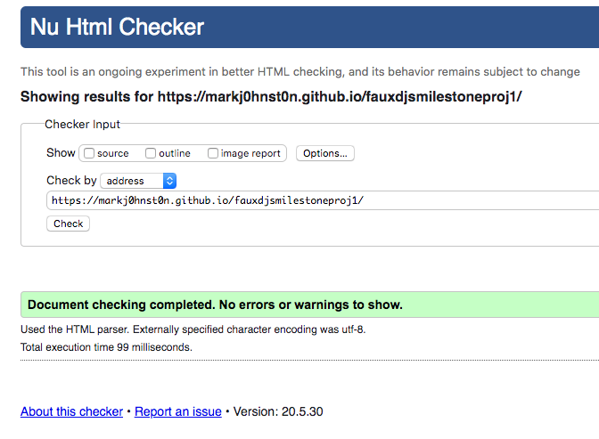
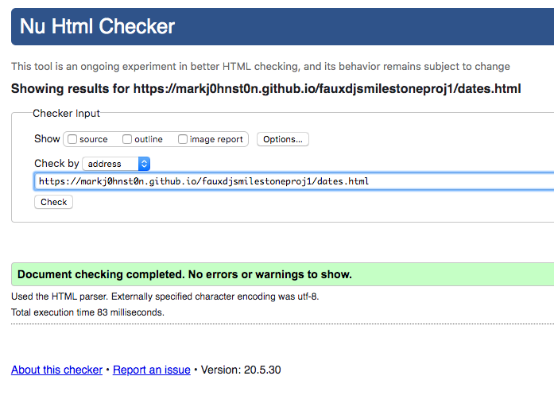
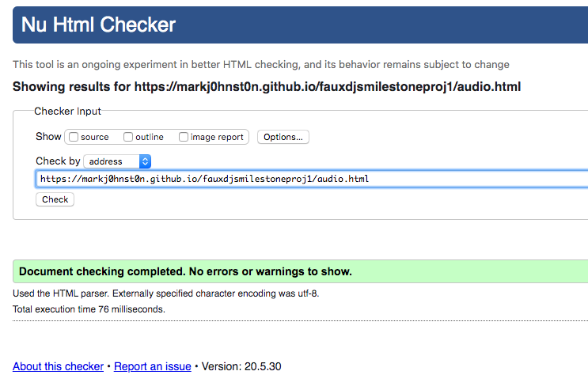
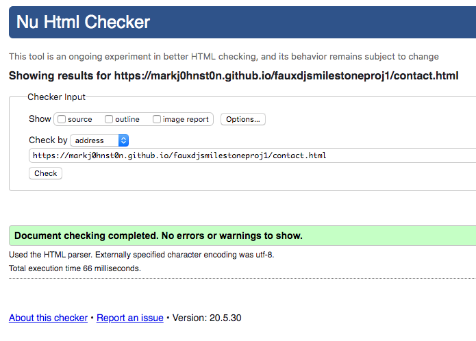

<h1>FAUX DJS HOMEPAGE</h1>

Welcome to the new homepage for Belfast DJ duo FAUX DJS!

This is the hub for all potential fans and employers of Faux DJs.  It is a simple, minimal, intuative, easy to use website with emphasis on their 
particular style of music to attract potential collaborators and also a resource for potential fans to hear more of what they do musically and find out where 
to hear them play in the future.  Social media links are included so you can find out more!

To go to the live site click [here](https://markj0hnst0n.github.io/fauxdjsmilestoneproj1/)

# UX

## User Stories

### There are 2 potential types of user for this site.  Fans and potential employers.

- All users should get a short concise description about Faux Djs with some basic information about who they are and what they do

- Fans and potential employers shoud be able to listen to dj mixes and playlists to get and idea about all the types of music they play.

- Fans should be able to check out where and when they are playing in the near future so that they can hear them play.

- Potential employers should be able to find out when Faux DJs are available for their gig.

- Potential employers should easily be able to contact Faux DJs to check availability for potential gigs

- All users should be able to navigate the website easily and all available information on the website should be easily and intuatively accessed.

- All users should be able to find links to various social media channels, most importantly facebook and instagram, on all pages at all times.

## Wireframes

Basic wireframes for this project were created using Balsamiq and you can find a link to the balsamiq project file [here](https://github.com/markj0hnst0n/fauxdjsmilestoneproj1/blob/master/wireframes/faux_djs_website_wireframes.bmpr)

[Wireframes Pictures Repository](https://github.com/markj0hnst0n/fauxdjsmilestoneproj1/tree/master/wireframes)

## Colour Scheme

A simple colour scheme was intended for this project as the design was to look minimal, also a moodboard of different photos was requested form the client to gain an understanding of the atmosphere they wanted to create with the site.
On consultation with the client a dusky lavender pink background [colour](http://hex.wikimix.info/en/color-dd85d7) was selected to stand out visually in comparison to other websites and also
visually and also to match the colour scheme of the photos that were selected to use for the project.

Initially a light blue font colour was chosen to contrast against the pink background but this was found to score low on accessibility on google lighthouse for users with visual impairments so black was selected as tke main font colour for
easier reading by these users.

### Features

#### Bootstrap Navbar

- allows all users to access Dates when Faux DJs, Audio of what they play and contact details via links to all parts of the site

#### Bio Paragraph Section

- allows all users to find out a bit of basic information about Faux DJs

#### Footer Social Media Links

- allows all users to access social media channels so that they can find more information about Faux DJs

#### Book Us Now Callout button

- allows potential employers to easily access contact form instantly 

#### Dates Page Table

-  allows fans to find out when we're next playing and allows potential employers to see if we are available when they need us

#### Audio Page Pictures and embedded content

- allows fans and potential employers to hear what Faux DJs do musically

#### Contact form

- allows potential employers to contact Faux DJs for gigs

## Features left to impliment

- Photos Section showing the atmosphere at a Faux DJs gig
- Reviews section on homepage of previous employers and influencers endorsing Faux DJs

# Technologies Used

[HTML5](https://en.wikipedia.org/wiki/HTML5)
for the structure of the website

[CSS 3](https://en.wikipedia.org/wiki/Cascading_Style_Sheets#CSS_3)
for the look of the website

[Font Awesome](https://fontawesome.com/)
for socail media icons

[Bootstrap 4](https://getbootstrap.com/)
for navbar, grid layout strucutre & form layout structure

[Asana](https://asana.com/)
for project managment

[Balsamiq Wireframes](https://balsamiq.com/wireframes/)
for creating Wireframes for initial visual development

[Gitpod](https://www.gitpod.io/) for writing and testing code.

[GitHub](https://github.com/) for storing code.

[Google Chrome Development Tools](https://developers.google.com/web/tools/chrome-devtools) for testing code on various device sizes during development.

[PicResize](https://picresize.com/) to change picture sizes for formatting purposes.

[Web Formatter](https://webformatter.com/) to format HTML and CSS code.

[Troy](http://troy.labs.daum.net/) to test website on different device types and sizes

[Google Lighthouse](https://developers.google.com/web/tools/lighthouse) for testing code health, accessibility, speed and search engine optimisation

Modified Embedded Code from https://soundcloud.com/ and https://www.spotify.com/

# Testing

### On all Listed Devices the following tests were performed:

- Home page opened and scrolled to read entire Bio.

- Audio page opened and scrolled so all content was viewable and mixes tested for audio.

- Dates page opened and scrolled to ensure all dates, venues and times were readable.

- Home page opened and scrolled to ensure book now button is readble.

- Contact page opened and form scrolled so that all parts a viewable.

- Contact page form submit button clicked and required message returned to ensure form works correctly.

- Open all pages and check that link tree can be easily viewed at all times.

- Open all pages and check that social media icons are easily viewed at all times.

The tests were performed live on Apple Macbook Pro running the following browsers without issue:

- Google Chrome
- Google Chromium
- Safari
- Opera
- Mozilla Firefox

Screenshots showing these user stories live on desktiop can be found [here](https://github.com/markj0hnst0n/fauxdjsmilestoneproj1/tree/master/readme)

The following devices were emulated on Google Chrome developer tools running the site with no issues:

- Ipad
- Ipad Pro
- Iphones 5 to X
- Google Pixel
- Google Pixel XL

The Website was tested on the [Troy](http://troy.labs.daum.net/) site using the tests below with no issues.

Devices emulated are as follows:

- PC Screen
- Ipad
- Ipad Retina
- Samsung S8
- Samsung Galaxy Tab S

### Google Lighthouse testing documentation for desktop and mobile for all pages can be found in PDF form [here](https://github.com/markj0hnst0n/fauxdjsmilestoneproj1/tree/master/testing_information)

NB: Speed Testing information on Lighthouse seemed to be variable as it could change depending on time of day.

### W3C HTML and CSS validators – to test for any Errors in the code

### Screenshots of final w3c passes

- Homepage

- Dates page

- Audio Page

-Contact Page

### Debugging information

Bug: Couldn't center logo on bootstrap navbar.

Debug: Set navbar postion to relative and logo position to absolute.  Didn't end up using this though as it made index.html feel unbalanced.

Bug: fixed-top bootstrap class made content unviewable on all pages.

Debug: adjusted margin-top and margin-bottom on all pages so that content was viewable again.

Bug: After commit 28 Google Lighthouse Audit identified that iframes had no titles from embedded soundcloud and spotify code on audio.html.  

Debug: Added iframe titlesfor better accessibility on screenreader.

Bug: google lighthouse identified this these cross-origin links unsafe destinations in soundcloud links on audio.html.

Debug: added rel="noopener” to target=“_blank”.  Amended this on index.html, dates.html and contact.html also as all social media links included target=“_blank”

Bug: After commit 27 w3c html code checker returned errors for css being used inline to style width for embedded soundcloud and spotify code on audio.html.  

Debug: Fixed this by using a bespoke class and amending style.css with the relevant code.

Bug: frameborder and scrolling in embedded code as this also returned errors in w3c html editor.  

Debug: Removed them as they are obselete elements 

Bug: w3c returned errors as some img did not have alt tags.

Debug: Added alt tags to img tags identified as also causing errors.

Bug: Dates.html had an error in w3c validator as a h2 tag was used in a table. 

Debug: h2 tag removed and used more suitable tag

Bug: Previously warning was returned on w3c validator as was showing that file could not be mapped in xml due to hypens being used more than twice in a row.

Debug: Amended html comments so that it is now mappable in xml files.  

Bug: Section on homepage had no heading element so made site less accessable to visually impaired users

Debug: Added h2 child to section element on homepage to make page more descriptive to visually impaired users. 

Bug: Date and time input types for form are not supported in firefox and safari respectively.

Debug: Amended contact.html form to take away these and used text types and placeholder info to guide users.

Bug: Links did not open in new window on dates page.

Debug: added target"_blank" to links to make them open in new window.

# Deployment

## Using Github Pages

In the GitHub Repository from the project https://github.com/markj0hnst0n/fauxdjsmilestoneproj1/

1. Click the 'Settings' Tab.
2. Scroll Down to the Git Hub Pages Heading.
3. Select 'Master Branch' as the source.
4. The Page will reload 'Settings' again.
5. Scroll to GitHub pages heading and there will now be a clickable link https://markj0hnst0n.github.io/fauxdjsmilestoneproj1/
6. Click this link for the live deployed page

## Run Locally

In the GitHub Repository from the project https://github.com/markj0hnst0n/fauxdjsmilestoneproj1/

1. Click Clone or Download
2. Copy Git URL from the dialogue box
3. Open your developement editor of choice and open a terminal window in a directory of your choice
4. Use the 'git clone' command in terminal followed by the copied git URL
5. A clone of the project will be created locally on your machine

# Credits

## Content

Written content by Mark Johnston

## Media

Photographs © [Filly Campbell](https://www.facebook.com/fillycampbellphotography/) and [Niall Murphy](https://www.facebook.com/niallmurphyphotography/) used with permission.

DJ Mixes by Faux Djs (Scott Lowry and Mark Johnston)

Laverys spotify playlist by [Pete Woods](https://www.facebook.com/DJPeteWoods/) with contributions from Faux DJs used with permission 

## Influences

My main influence for this site was simplicity.  Every element must have a function and it must work well.

I took layout pointers from the following websites.

[Guilt Trip Coffee Website](https://www.guilttripcoffee.com/)

[Established Coffee Website](https://established.coffee/)

I also looked at the following website for some guidance on the 'dates' page:

[Mac Demarco Tour Page](https://www.mac-demarco.com/tour/)

## Acknowledgements

Thanks to the following people for making the project happen:

- My Mentor Precious Ijege for his guidance on key concepts and patience in explaining them!
- The [Code Institute](https://codeinstitute.net/) Slack Community and in particular Tom Dignan for his help is centering my logo within a bootstrap navbar.  I didn't go in this direction but it was a good learning expirience trying to solve this problem!
- The [Code Institute](https://codeinstitute.net/) tutors and instructional material.
- My Wife Joanna Johnston for her (contructive) criticism and understanding when I lock myself away in the attic for hours on end
